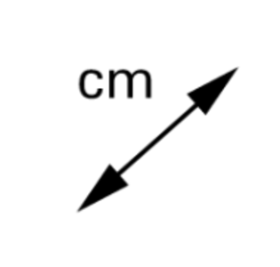
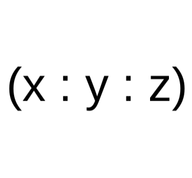
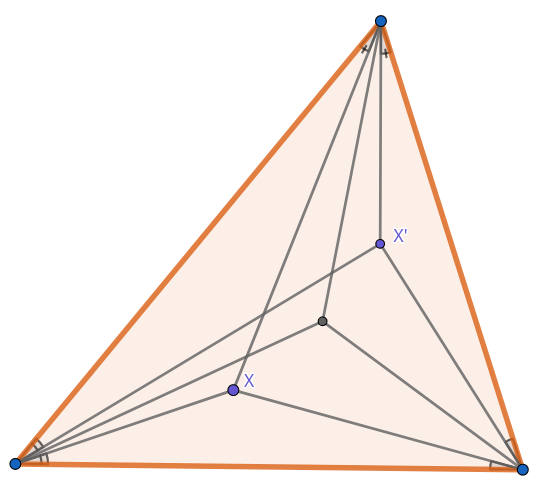
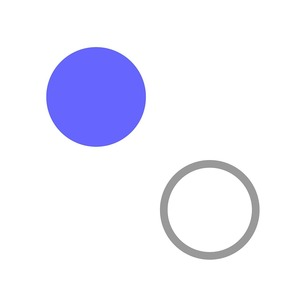
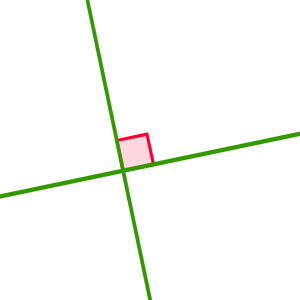

# Barycentric Geometry Calculator

## Welcome to our project!

Main information about it you can see in file "Barycentric\_Geometry\_Solver-1" in Architecture folder.

## Installation

If you want to start project, firstly, you have to install SFML and Ginac library. You can do it using
(Ubuntu exmaple):
```sh
$ sudo apt-get install libsfml-dev
$ sudo apt-get install -y ginac-tools
```
After that you have to clone repository using

```sh
$ git clone https://gitlab.akhcheck.ru/ivan.postnov/baricentric-geometry-project.git
```

## Using

To start project you should write following commands:

```sh
$ mkcd build
$ cmake ..
$ make
$ ./MyProject
``` 
or you can just run it from any IDE.

## Features
Using the buttons, make a construction to study a geometric picture or prove a fact


Here are some of them:


NoMode - nothing happens, in order to think about the next step<br />



Outputs the square of the distance between the selected points The output is a polynomial from the sides of the original triangle<br />



Outputs barycentric non-normalized coordinates<br />



The isogonal conjugates the point. For more information, read the [article](https://geometry.ru/articles/isogonal_prokopenko.pdf)<br />


**Important:** *Do not isogonal conjugates the points lying on the sides of the triangle, in this version this leads to an error*



When you click on a point, its name is hidden<br />



Checks the orthogonality of the selected straight lines. Outputs the final polynomial, which should be equal to 0.
Any geometric fact is written as the identity of the polynomials.<br />


For more information about barycentric coordinates, read the [article](https://web.evanchen.cc/handouts/bary/bary-full.pdf)


The rest of the buttons should be clear from their picture.


**Have a good research**


## UML photo


## Project team
Project was done by Postnov Ivan and Lopatin Egor, 2023-2027 MIPT students, Б05-327 group. 
