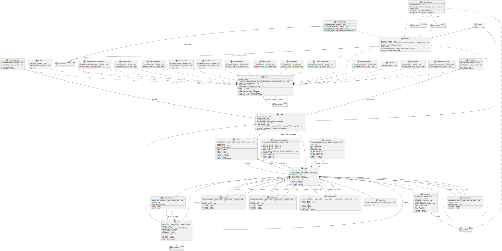

# Barycentric Geometry Calculator

## Welcome to our project!

Main information about it you can see in file "Barycentric\_Geometry\_Solver-1" in Architecture folder.

## Installation

If you want to start project, firstly, you have to install SFML and Ginac library. You can do it using
(Ubuntu exmaple):
```sh
$ sudo apt-get install libsfml-dev
$ sudo apt-get install -y ginac-tools
```
After that you have to clone repository using

```sh
$ git clone https://gitlab.akhcheck.ru/ivan.postnov/baricentric-geometry-project.git
```

## Using

To start project you should write following commands:

```sh
$ mkcd build
$ cmake ..
$ make
$ ./MyProject
``` 
or you can just run it from any IDE.

## Features
Using the buttons, make a construction to study a geometric picture or prove a fact

Defining buttons from left to right from top to bottom:


NoMode - nothing happens, in order to think about the next step


## UML photo



## Project team
Project was done by Postnov Ivan and Lopatin Egor, 2023-2027 MIPT students, Б05-327 group. 
