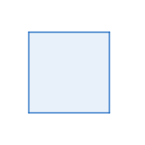

# Barycentric Geometry Calculator

## Welcome to our project!

<!--Main information about it you can see in file "Barycentric\_Geometry\_Solver-1" in Architecture folder.-->

This is a project for calculating geometric problems in barycentric coordinates. You build a picture using tools.

**Important**: the construction must be deterministic with respect to points (for example, you cannot intersect any straight line with a circle, the two points obtained are equal with respect to coordinates).

Your acceptable degree of freedom ( in this version ) mark one independent point. After the construction, use the proof tool. If the task is correct, information about it will be displayed in the console and a **build/Proof.tex file will be created**, which contains a step-by-step solution to the problem. Otherwise, the console will display information that the task is incorrect and you will also be able to see under what conditions on the sides of the triangle the task is correct.

## Installation

If you want to start project, firstly, you have to install SFML and Ginac library. You can do it using
(Ubuntu exmaple):
```sh
$ sudo apt-get install libsfml-dev
$ sudo apt-get install -y ginac-tools
```
After that you have to clone repository using

```sh
$ git clone https://gitlab.akhcheck.ru/ivan.postnov/baricentric-geometry-project.git
```

## Using

To start project you should write following commands:

```sh
$ mkcd build
$ cmake ..
$ make
$ ./MyProject
``` 
or

```sh
./run.sh
```

or you can just run it from any IDE.

## Running Docker Images

To run Docker image of the project you should do the following:

1) Install xhost. It can be done by

```sh
$ sudo apt-get install xorg-xhost
```
2) Run

```sh
$ xhost +local:
$ docker build .
$ docker run -e DISPLAY=unix$DISPLAY -v /tmp/.X11-unix:/tmp/.X11-unix <image name> 2> /dev/null
```

## Features
Using the buttons, make a construction to study a geometric picture or prove a fact


Here are some of them:

<br>

NoMode - nothing happens, in order to think about the next step
<br>

<br>
<div>

<p>Outputs the square of the distance between the selected points The output is a polynomial from the sides of the original triangle</p><br />
</div>
<br>

<br>

Outputs barycentric non-normalized coordinates<br />
<br>


The isogonal conjugates the point. For more information, read the [article](https://geometry.ru/articles/isogonal_prokopenko.pdf)<br />


**Important:** *Do not isogonal conjugates the points lying on the sides of the triangle, in this version this leads to an error*


When you click on a point, its name is hidden <br />

<br>
<div>

<p> Checks the orthogonality of the selected straight lines. Outputs the final polynomial, which should be equal to 0. 
Any geometric fact is written as the identity of the polynomials.</p> <br /> </div>


For more information, read the [article](https://web.evanchen.cc/handouts/bary/bary-full.pdf)


The rest of the buttons should be clear from their picture.


### Have a good research

## Project team
Project was done by Postnov Ivan and Lopatin Egor, 2023-2027 MIPT students, Б05-327 group. 
